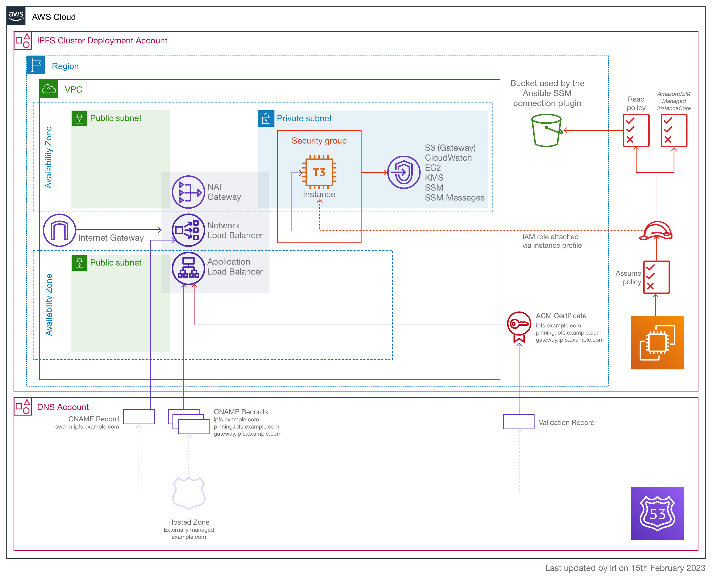

<!-- markdownlint-disable -->
# terraform-aws-ipfs-cluster
<!-- markdownlint-restore -->

<!-- [![README Header][readme_header_img]][readme_header_link] -->

[![The Guardian][logo]][website]

<!--


  ** DO NOT EDIT THIS FILE
  **
  ** This file was automatically generated by the `build-harness`.
  ** 1) Make all changes to `README.yaml`
  ** 2) Run `make init` (you only need to do this once)
  ** 3) Run`make readme` to rebuild this file.
  **
  ** (We maintain HUNDREDS of open source projects. This is how we maintain our sanity.)
  **


-->

Terraform module to deploy an IPFS cluster into AWS.



---


It's free and open source made available under the the [GNU Affero General Public v3 License](LICENSE.md).


<!-- markdownlint-disable -->
## Requirements

| Name | Version |
|------|---------|
| <a name="requirement_terraform"></a> [terraform](#requirement\_terraform) | >= 1.3.5 |
| <a name="requirement_aws"></a> [aws](#requirement\_aws) | >= 4.52.0 |
| <a name="requirement_cloudinit"></a> [cloudinit](#requirement\_cloudinit) | >= 2.2.0 |
| <a name="requirement_random"></a> [random](#requirement\_random) | >= 3.4.3 |
| <a name="requirement_tls"></a> [tls](#requirement\_tls) | >= 4.0.4 |

## Providers

| Name | Version |
|------|---------|
| <a name="provider_aws"></a> [aws](#provider\_aws) | 4.53.0 |
| <a name="provider_aws.dns"></a> [aws.dns](#provider\_aws.dns) | 4.53.0 |
| <a name="provider_cloudinit"></a> [cloudinit](#provider\_cloudinit) | 2.2.0 |
| <a name="provider_tls"></a> [tls](#provider\_tls) | 4.0.4 |

## Modules

| Name | Source | Version |
|------|--------|---------|
| <a name="module_dummy_subnet"></a> [dummy\_subnet](#module\_dummy\_subnet) | cloudposse/dynamic-subnets/aws | 2.1.0 |
| <a name="module_dynamic_subnet"></a> [dynamic\_subnet](#module\_dynamic\_subnet) | cloudposse/dynamic-subnets/aws | 2.1.0 |
| <a name="module_ec2_security_group"></a> [ec2\_security\_group](#module\_ec2\_security\_group) | cloudposse/security-group/aws | 2.0.0 |
| <a name="module_instance_role_profile"></a> [instance\_role\_profile](#module\_instance\_role\_profile) | sr2c/ec2-conf-log/aws | 0.0.2 |
| <a name="module_kms_key"></a> [kms\_key](#module\_kms\_key) | cloudposse/kms-key/aws | 0.12.1 |
| <a name="module_label_alb"></a> [label\_alb](#module\_label\_alb) | cloudposse/label/null | 0.25.0 |
| <a name="module_label_log_bucket"></a> [label\_log\_bucket](#module\_label\_log\_bucket) | cloudposse/label/null | 0.25.0 |
| <a name="module_this"></a> [this](#module\_this) | cloudposse/label/null | 0.25.0 |
| <a name="module_vpc"></a> [vpc](#module\_vpc) | cloudposse/vpc/aws | 2.0.0 |
| <a name="module_vpc_endpoints"></a> [vpc\_endpoints](#module\_vpc\_endpoints) | cloudposse/vpc/aws//modules/vpc-endpoints | 2.0.0 |

## Resources

| Name | Type |
|------|------|
| [aws_acm_certificate.ipfs_certificate](https://registry.terraform.io/providers/hashicorp/aws/latest/docs/resources/acm_certificate) | resource |
| [aws_acm_certificate_validation.ipfs_certificate](https://registry.terraform.io/providers/hashicorp/aws/latest/docs/resources/acm_certificate_validation) | resource |
| [aws_ebs_volume.data](https://registry.terraform.io/providers/hashicorp/aws/latest/docs/resources/ebs_volume) | resource |
| [aws_instance.default](https://registry.terraform.io/providers/hashicorp/aws/latest/docs/resources/instance) | resource |
| [aws_key_pair.default](https://registry.terraform.io/providers/hashicorp/aws/latest/docs/resources/key_pair) | resource |
| [aws_lb.application](https://registry.terraform.io/providers/hashicorp/aws/latest/docs/resources/lb) | resource |
| [aws_lb.network](https://registry.terraform.io/providers/hashicorp/aws/latest/docs/resources/lb) | resource |
| [aws_lb_listener.application_listener](https://registry.terraform.io/providers/hashicorp/aws/latest/docs/resources/lb_listener) | resource |
| [aws_lb_listener.network_listener](https://registry.terraform.io/providers/hashicorp/aws/latest/docs/resources/lb_listener) | resource |
| [aws_lb_listener_rule.ipfs_api](https://registry.terraform.io/providers/hashicorp/aws/latest/docs/resources/lb_listener_rule) | resource |
| [aws_lb_listener_rule.ipfs_gateway](https://registry.terraform.io/providers/hashicorp/aws/latest/docs/resources/lb_listener_rule) | resource |
| [aws_lb_listener_rule.ipfs_pinning](https://registry.terraform.io/providers/hashicorp/aws/latest/docs/resources/lb_listener_rule) | resource |
| [aws_lb_target_group.ipfs_api](https://registry.terraform.io/providers/hashicorp/aws/latest/docs/resources/lb_target_group) | resource |
| [aws_lb_target_group.ipfs_gateway](https://registry.terraform.io/providers/hashicorp/aws/latest/docs/resources/lb_target_group) | resource |
| [aws_lb_target_group.ipfs_pinning](https://registry.terraform.io/providers/hashicorp/aws/latest/docs/resources/lb_target_group) | resource |
| [aws_lb_target_group.ipfs_swarm](https://registry.terraform.io/providers/hashicorp/aws/latest/docs/resources/lb_target_group) | resource |
| [aws_lb_target_group_attachment.ipfs_api](https://registry.terraform.io/providers/hashicorp/aws/latest/docs/resources/lb_target_group_attachment) | resource |
| [aws_lb_target_group_attachment.ipfs_gateway](https://registry.terraform.io/providers/hashicorp/aws/latest/docs/resources/lb_target_group_attachment) | resource |
| [aws_lb_target_group_attachment.ipfs_pinning](https://registry.terraform.io/providers/hashicorp/aws/latest/docs/resources/lb_target_group_attachment) | resource |
| [aws_lb_target_group_attachment.network_listener](https://registry.terraform.io/providers/hashicorp/aws/latest/docs/resources/lb_target_group_attachment) | resource |
| [aws_route53_record.cluster](https://registry.terraform.io/providers/hashicorp/aws/latest/docs/resources/route53_record) | resource |
| [aws_route53_record.swarm](https://registry.terraform.io/providers/hashicorp/aws/latest/docs/resources/route53_record) | resource |
| [aws_route53_record.validation](https://registry.terraform.io/providers/hashicorp/aws/latest/docs/resources/route53_record) | resource |
| [aws_s3_bucket.log_bucket](https://registry.terraform.io/providers/hashicorp/aws/latest/docs/resources/s3_bucket) | resource |
| [aws_s3_bucket_acl.log_bucket](https://registry.terraform.io/providers/hashicorp/aws/latest/docs/resources/s3_bucket_acl) | resource |
| [aws_s3_bucket_lifecycle_configuration.log_bucket](https://registry.terraform.io/providers/hashicorp/aws/latest/docs/resources/s3_bucket_lifecycle_configuration) | resource |
| [aws_s3_bucket_policy.alb_log_bucket](https://registry.terraform.io/providers/hashicorp/aws/latest/docs/resources/s3_bucket_policy) | resource |
| [aws_s3_bucket_policy.log_bucket](https://registry.terraform.io/providers/hashicorp/aws/latest/docs/resources/s3_bucket_policy) | resource |
| [aws_s3_bucket_public_access_block.default](https://registry.terraform.io/providers/hashicorp/aws/latest/docs/resources/s3_bucket_public_access_block) | resource |
| [aws_s3_bucket_server_side_encryption_configuration.log_bucket](https://registry.terraform.io/providers/hashicorp/aws/latest/docs/resources/s3_bucket_server_side_encryption_configuration) | resource |
| [aws_s3_bucket_versioning.log_bucket](https://registry.terraform.io/providers/hashicorp/aws/latest/docs/resources/s3_bucket_versioning) | resource |
| [aws_security_group.public_load_balancer](https://registry.terraform.io/providers/hashicorp/aws/latest/docs/resources/security_group) | resource |
| [aws_volume_attachment.default](https://registry.terraform.io/providers/hashicorp/aws/latest/docs/resources/volume_attachment) | resource |
| [tls_private_key.default](https://registry.terraform.io/providers/hashicorp/tls/latest/docs/resources/private_key) | resource |
| [aws_ami.default](https://registry.terraform.io/providers/hashicorp/aws/latest/docs/data-sources/ami) | data source |
| [aws_availability_zones.this](https://registry.terraform.io/providers/hashicorp/aws/latest/docs/data-sources/availability_zones) | data source |
| [aws_caller_identity.this](https://registry.terraform.io/providers/hashicorp/aws/latest/docs/data-sources/caller_identity) | data source |
| [aws_elb_service_account.main](https://registry.terraform.io/providers/hashicorp/aws/latest/docs/data-sources/elb_service_account) | data source |
| [aws_iam_policy_document.ipfs_cluster_alb](https://registry.terraform.io/providers/hashicorp/aws/latest/docs/data-sources/iam_policy_document) | data source |
| [aws_iam_policy_document.kms](https://registry.terraform.io/providers/hashicorp/aws/latest/docs/data-sources/iam_policy_document) | data source |
| [aws_route53_zone.this](https://registry.terraform.io/providers/hashicorp/aws/latest/docs/data-sources/route53_zone) | data source |
| [cloudinit_config.this](https://registry.terraform.io/providers/hashicorp/cloudinit/latest/docs/data-sources/config) | data source |

## Inputs

| Name | Description | Type | Default | Required |
|------|-------------|------|---------|:--------:|
| <a name="input_additional_tag_map"></a> [additional\_tag\_map](#input\_additional\_tag\_map) | Additional tags for appending to tags\_as\_list\_of\_maps. Not added to `tags`. | `map(string)` | `{}` | no |
| <a name="input_alb_logs_expiration_days"></a> [alb\_logs\_expiration\_days](#input\_alb\_logs\_expiration\_days) | The number of days after which the application load balancer's logs expire. | `number` | `30` | no |
| <a name="input_attributes"></a> [attributes](#input\_attributes) | Additional attributes (e.g. `1`) | `list(string)` | `[]` | no |
| <a name="input_context"></a> [context](#input\_context) | Single object for setting entire context at once.<br>See description of individual variables for details.<br>Leave string and numeric variables as `null` to use default value.<br>Individual variable settings (non-null) override settings in context object,<br>except for attributes, tags, and additional\_tag\_map, which are merged. | `any` | <pre>{<br>  "additional_tag_map": {},<br>  "attributes": [],<br>  "delimiter": null,<br>  "enabled": true,<br>  "environment": null,<br>  "id_length_limit": null,<br>  "label_key_case": null,<br>  "label_order": [],<br>  "label_value_case": null,<br>  "name": null,<br>  "namespace": null,<br>  "regex_replace_chars": null,<br>  "stage": null,<br>  "tags": {}<br>}</pre> | no |
| <a name="input_delimiter"></a> [delimiter](#input\_delimiter) | Delimiter to be used between `namespace`, `environment`, `stage`, `name` and `attributes`.<br>Defaults to `-` (hyphen). Set to `""` to use no delimiter at all. | `string` | `null` | no |
| <a name="input_dns_zone_name"></a> [dns\_zone\_name](#input\_dns\_zone\_name) | The name of the DNS zone hosted in Route 53 that should be used to create the DNS records. | `string` | n/a | yes |
| <a name="input_domain_name"></a> [domain\_name](#input\_domain\_name) | The base domain name for the deployment. Subdomains of this domain will be used for the gateway, swarm and pinning<br>    services. | `string` | n/a | yes |
| <a name="input_ebs_volume_disk_allocation_gb"></a> [ebs\_volume\_disk\_allocation\_gb](#input\_ebs\_volume\_disk\_allocation\_gb) | How much disk space to allocate for the EC2 instance's data EBS volume. | `number` | `null` | no |
| <a name="input_ec2_disk_allocation_gb"></a> [ec2\_disk\_allocation\_gb](#input\_ec2\_disk\_allocation\_gb) | How much disk space to allocate for the EC2 instance's root EBS volume. | `number` | `null` | no |
| <a name="input_ec2_instance_type"></a> [ec2\_instance\_type](#input\_ec2\_instance\_type) | The EC2 instance class to use. | `string` | `null` | no |
| <a name="input_enabled"></a> [enabled](#input\_enabled) | Set to false to prevent the module from creating any resources | `bool` | `null` | no |
| <a name="input_environment"></a> [environment](#input\_environment) | Environment, e.g. 'uw2', 'us-west-2', OR 'prod', 'staging', 'dev', 'UAT' | `string` | `null` | no |
| <a name="input_id_length_limit"></a> [id\_length\_limit](#input\_id\_length\_limit) | Limit `id` to this many characters (minimum 6).<br>Set to `0` for unlimited length.<br>Set to `null` for default, which is `0`.<br>Does not affect `id_full`. | `number` | `null` | no |
| <a name="input_label_key_case"></a> [label\_key\_case](#input\_label\_key\_case) | The letter case of label keys (`tag` names) (i.e. `name`, `namespace`, `environment`, `stage`, `attributes`) to use in `tags`.<br>Possible values: `lower`, `title`, `upper`.<br>Default value: `title`. | `string` | `null` | no |
| <a name="input_label_order"></a> [label\_order](#input\_label\_order) | The naming order of the id output and Name tag.<br>Defaults to ["namespace", "environment", "stage", "name", "attributes"].<br>You can omit any of the 5 elements, but at least one must be present. | `list(string)` | `null` | no |
| <a name="input_label_value_case"></a> [label\_value\_case](#input\_label\_value\_case) | The letter case of output label values (also used in `tags` and `id`).<br>Possible values: `lower`, `title`, `upper` and `none` (no transformation).<br>Default value: `lower`. | `string` | `null` | no |
| <a name="input_name"></a> [name](#input\_name) | Solution name, e.g. 'app' or 'jenkins' | `string` | `null` | no |
| <a name="input_namespace"></a> [namespace](#input\_namespace) | Namespace, which could be your organization name or abbreviation, e.g. 'eg' or 'cp' | `string` | `null` | no |
| <a name="input_regex_replace_chars"></a> [regex\_replace\_chars](#input\_regex\_replace\_chars) | Regex to replace chars with empty string in `namespace`, `environment`, `stage` and `name`.<br>If not set, `"/[^a-zA-Z0-9-]/"` is used to remove all characters other than hyphens, letters and digits. | `string` | `null` | no |
| <a name="input_stage"></a> [stage](#input\_stage) | Stage, e.g. 'prod', 'staging', 'dev', OR 'source', 'build', 'test', 'deploy', 'release' | `string` | `null` | no |
| <a name="input_tags"></a> [tags](#input\_tags) | Additional tags (e.g. `map('BusinessUnit','XYZ')` | `map(string)` | `{}` | no |

## Outputs

| Name | Description |
|------|-------------|
| <a name="output_domain_name"></a> [domain\_name](#output\_domain\_name) | The base domain name for the deployment. Subdomains of this domain will be used for the gateway, swarm and pinning<br>    services. |
| <a name="output_ec2_instance_id"></a> [ec2\_instance\_id](#output\_ec2\_instance\_id) | The instance ID of the EC2 instance. |
| <a name="output_gateway_domain_name"></a> [gateway\_domain\_name](#output\_gateway\_domain\_name) | The domain name of the gateway endpoint. |
| <a name="output_pinning_domain_name"></a> [pinning\_domain\_name](#output\_pinning\_domain\_name) | The domain name of the pinning endpoint. |
| <a name="output_swarm_domain_name"></a> [swarm\_domain\_name](#output\_swarm\_domain\_name) | The domain name of the swarm endpoint. |
<!-- markdownlint-restore -->
<!-- markdownlint-disable -->
## Makefile Targets
```text
Available targets:

  help                                Help screen
  help/all                            Display help for all targets
  help/short                          This help short screen
  lint                                Lint terraform code

```
<!-- markdownlint-restore -->


## Share the Love

Like this project? Please give it a ★ on [our GitLab](https://gitlab.com/guardianproject-ops/terraform-aws-ipfs-cluster)! (it helps us **a lot**)


## Related Projects

Check out these related projects.

- [terraform-null-label](https://github.com/cloudposse/terraform-null-label) - Terraform module designed to generate consistent names and tags for resources. Use terraform-null-label to implement a strict naming convention.

## Help

**Got a question?** We got answers.

File a GitLab [issue](https://gitlab.com/guardianproject-ops/terraform-aws-ipfs-cluster/-/issues), send us an [email][email] or join our [Matrix Community][matrix].

## Matrix Community

[][matrix]

Join our [Open Source Community][matrix] on Matrix. It's **FREE** for everyone!
This is the best place to talk shop, ask questions, solicit feedback, and work
together as a community to build on our open source code.

## Contributing

### Bug Reports & Feature Requests

Please use the [issue tracker](https://gitlab.com/guardianproject-ops/terraform-aws-ipfs-cluster/-/issues) to report any bugs or file feature requests.

### Developing

If you are interested in being a contributor and want to get involved in developing this project or help out with our other projects, we would love to hear from you! Shoot us an [email][email].

In general, PRs are welcome. We follow the typical "fork-and-pull" Git workflow.

 1. **Fork** the repo on GitLab
 2. **Clone** the project to your own machine
 3. **Commit** changes to your own branch
 4. **Push** your work back up to your fork
 5. Submit a **Pull Request** so that we can review your changes

**NOTE:** Be sure to merge the latest changes from "upstream" before making a pull request!


## Copyright

Copyright © 2021-2023 The Guardian Project


## License

[](https://www.gnu.org/licenses/agpl-3.0.en.html)

```text
GNU AFFERO GENERAL PUBLIC LICENSE
Version 3, 19 November 2007

This program is free software: you can redistribute it and/or modify
it under the terms of the GNU Affero General Public License as
published by the Free Software Foundation, either version 3 of the
License, or (at your option) any later version.

This program is distributed in the hope that it will be useful,
but WITHOUT ANY WARRANTY; without even the implied warranty of
MERCHANTABILITY or FITNESS FOR A PARTICULAR PURPOSE.  See the
GNU Affero General Public License for more details.

You should have received a copy of the GNU Affero General Public License
along with this program.  If not, see <https://www.gnu.org/licenses/>.
```


## Trademarks

All other trademarks referenced herein are the property of their respective owners.

## About

This project is maintained by [The Guardian Project][website].

[![The Guardian Project][logo]][website]

We're a [collective of designers, developers, and ops][website] folk focused on useable
privacy and security with a focus on digital human rights and humanitarian projects.

Everything we do is 100% FOSS. 

Follow us on [mastadon][mastadon] or [twitter][twitter], [apply for a job][join], or
[partner with us][partner].

We offer [paid support][contact] on all of our projects.

Check out [our other devops projects][gitlab] or our [entire other set of
projects][nonops] related to privacy and security related software, or [hire
us][website] to get support with using our projects.


## Contributors

<!-- markdownlint-disable -->
|  [![irl][irlxyz_avatar]][irlxyz_homepage]<br/>[irl][irlxyz_homepage] | [![redaranj][redaranj_avatar]][redaranj_homepage]<br/>[redaranj][redaranj_homepage] |
|---|---|
<!-- markdownlint-restore -->

  [irlxyz_homepage]: https://gitlab.com/irlxyz
  [irlxyz_avatar]: https://gitlab.com/uploads/-/system/user/avatar/5895869/avatar.png?width=130
  [redaranj_homepage]: https://gitlab.com/redaranj
  [redaranj_avatar]: https://secure.gravatar.com/avatar/a4bb148b2c1a615f4b77b1e192f8e410?s=192&d=identicon


<!-- markdownlint-disable -->
  [website]: https://guardianproject.info/?utm_source=gitlab&utm_medium=readme&utm_campaign=guardianproject-ops/terraform-aws-ipfs-cluster&utm_content=website
  [gitlab]: https://www.gitlab.com/guardianproject-ops
  [contact]: https://guardianproject.info/contact/
  [matrix]: https://matrix.to/#/%23guardianproject:matrix.org
  [readme_header_img]: https://gitlab.com/guardianproject/guardianprojectpublic/-/raw/master/Graphics/GuardianProject/pngs/logo-color-w256.png
  [readme_header_link]: https://guardianproject.info?utm_source=gitlab&utm_medium=readme&utm_campaign=guardianproject-ops/terraform-aws-ipfs-cluster&utm_content=readme_header_link
  [readme_commercial_support_img]: https://www.sr2.uk/readme/paid-support.png
  [readme_commercial_support_link]: https://www.sr2.uk/?utm_source=gitlab&utm_medium=readme&utm_campaign=guardianproject-ops/terraform-aws-ipfs-cluster&utm_content=readme_commercial_support_link
  [partner]: https://guardianproject.info/how-you-can-work-with-us/
  [nonops]: https://gitlab.com/guardianproject
  [mastadon]: https://social.librem.one/@guardianproject
  [twitter]: https://twitter.com/guardianproject
  [email]: mailto:support@guardianproject.info
  [join_email]: mailto:jobs@guardianproject.info
  [join]: https://guardianproject.info/contact/join/
  [logo_square]: https://assets.gitlab-static.net/uploads/-/system/group/avatar/3262938/guardianproject.png?width=88
  [logo]: https://gitlab.com/guardianproject/guardianprojectpublic/-/raw/master/Graphics/GuardianProject/pngs/logo-color-w256.png
  [logo_black]: https://gitlab.com/guardianproject/guardianprojectpublic/-/raw/master/Graphics/GuardianProject/pngs/logo-black-w256.png
  [cdr]: https://digiresilience.org
  [cdr-tech]: https://digiresilience.org/tech/
<!-- markdownlint-restore -->
